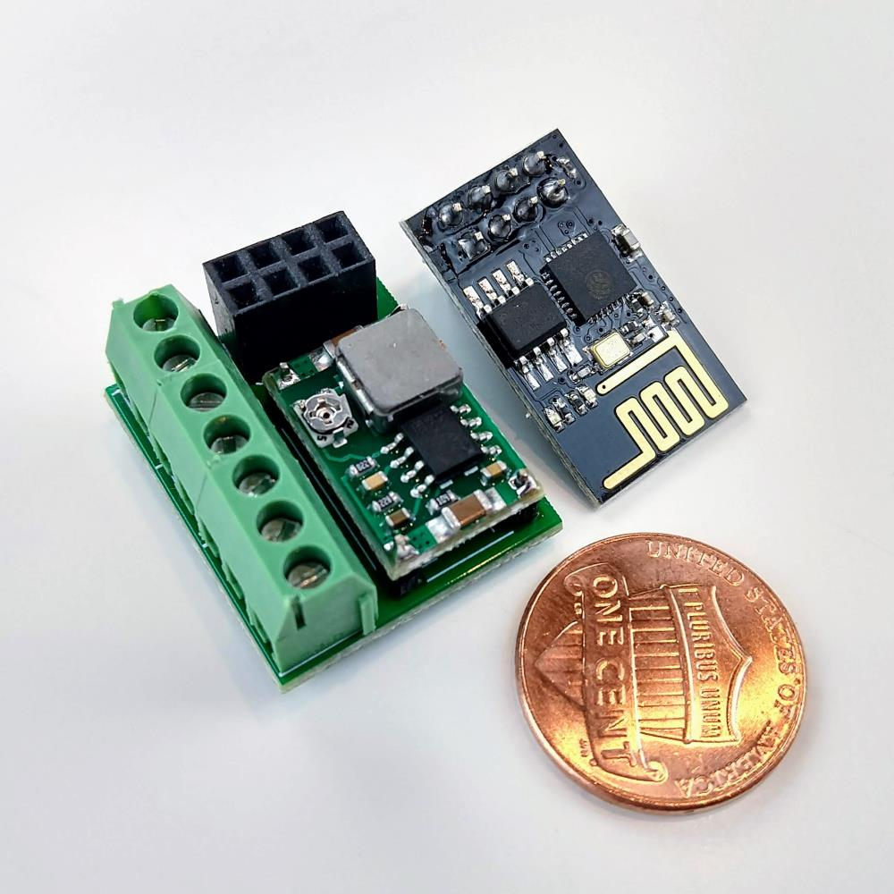
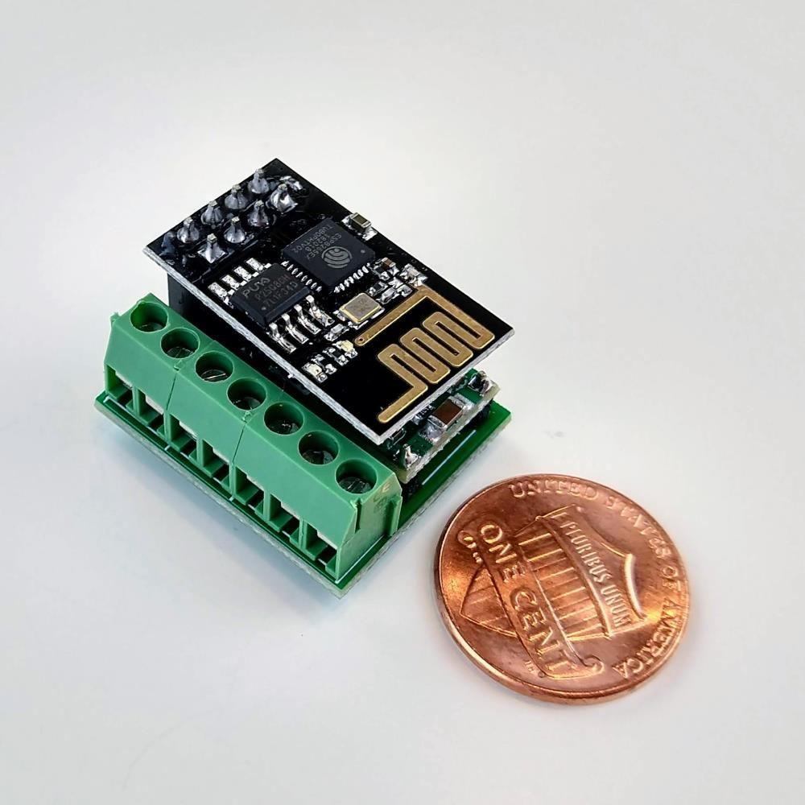

# PCB

Controller is designed to have extra small size (22x26x14mm) and cost under $2 per item. Four independent channels allows to create lamps with different blink effects or control RGB led strip.

   

# Eagle project for pcb manufactering

| Design | Description |
| :---: | --- |
| *Light&#160;SOT32* | Uses SOT32 MOSFET's mounted under voltage regultar. |
| *Light&#160;SOT32&#160;bottom* | Uses SOT32 MOSFET's mounted on the other side of the board. |
| *Light&#160;TO-220* | Uses TO220 MOSFET's for long led strips that requere high power. |
| *Panelized* | Contains all 3 kind of boards replicated 4 times. Archive contains all necessary files for a manufacterer. Board size does not exceed 100X100mm. It is the smalles and cheappes size. Could be ordered from [jlcpcb.com](https://jlcpcb.com/) for $2. |

`Light SOT32` and `Light SOT32 bottom` are low power versions of the board. It can handle up to 2A per chanel. When `Light TO-220` is a high power board with up to 15A per channel.

# Part list requered for one module

| Part | Amount |
| --- | :---: |
| Microcontroller Esp8266-01 | 1 |
| MOSFET ao3400 (for low power board version) | 4 |
| MOSFET P55NF06L (for high power board version) | 4 |
| Buck converter Mini 360 | 1 |
| Resistor 0805 10kOh | 2 |
| Pin Header 2x4 Pin 2.54mm | 1 |
| Terminal KF350-2P and KF350-3P | 2 |
| Terminal KF350-3P | 1 | 
| Male single row pin 2.54 | 4 |

# Panelized PCB

# Wiring schema

