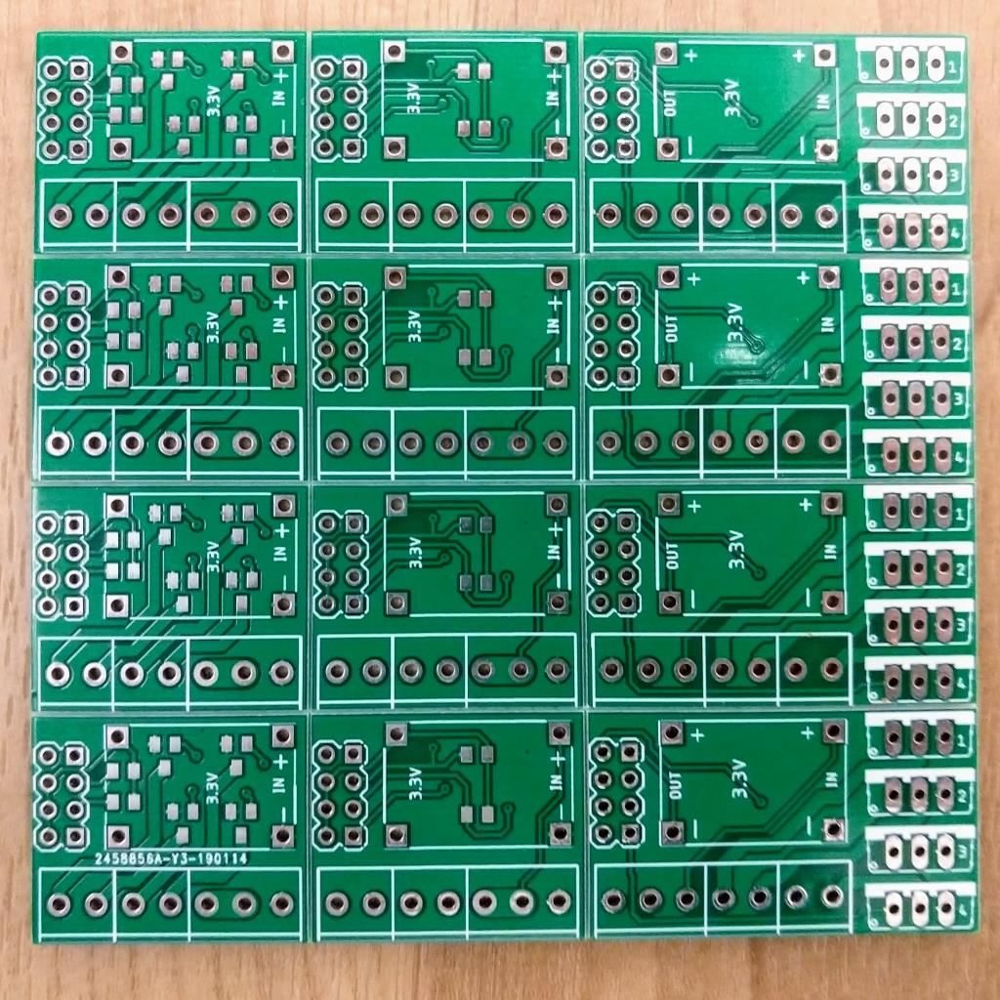
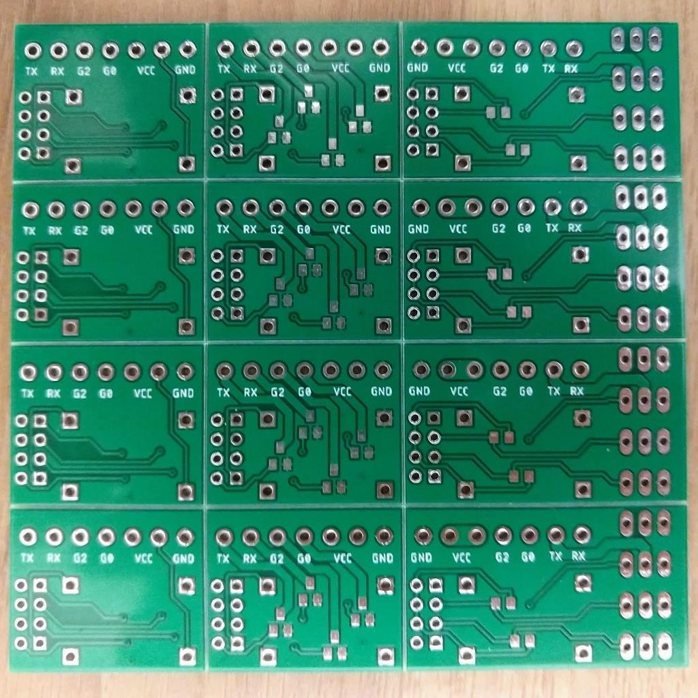

# Eagle project for manufactering pcb

`Light SOT32` pcb uses SOT32 MOSFET's mounted under voltage regultar 
`Light SOT32 bottom` pcb uses SOT32 MOSFET's mounted on the other side of the board 
`Light TO-220` pcb uses TO220 MOSFET's for long led strips that requere high power 
`Panelized` contains all 3 kind of boards replicated 4 times. Archive contains all necessary files for a manufacterer. Board size does not exceed 100X100mm. It is the smalles and cheappes size. I ordered [here](https://jlcpcb.com/) for $2. 

# Recomended part list

Everything could be found at [www.aliexpress.com](http://www.aliexpress.com) 

ESP8266: ESP-01 
SOT32 MOSFET: ao3400 
TO220 MOSFET: P55NF06L 
Voltage regulator: Mini 360 
Resistors 0805: 10kOh 
Pin Header 2x4 Pin 2.54mm 
Terminals: KF350-2P and KF350-3P 

# Panelized PCB

